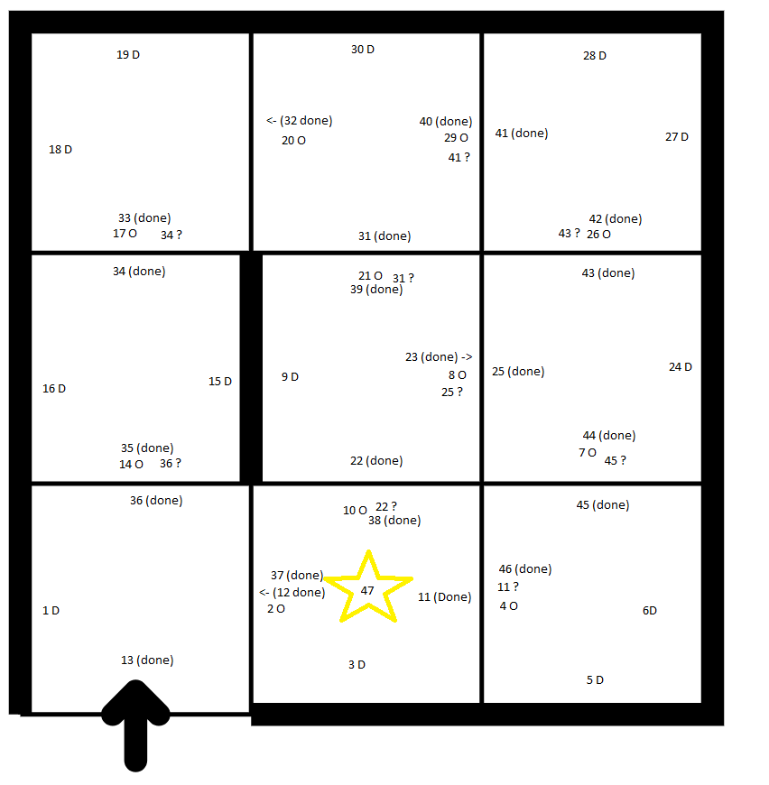
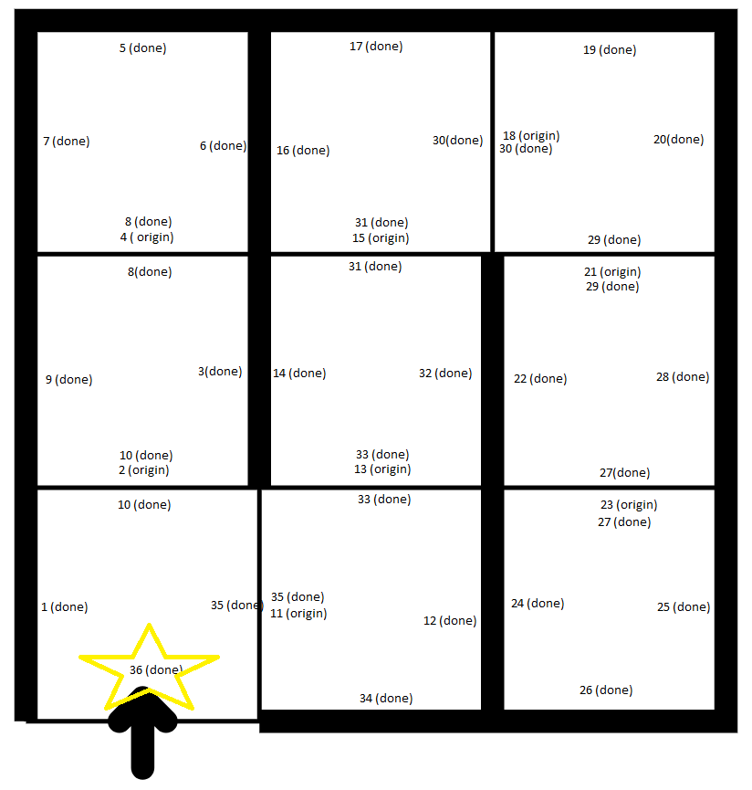
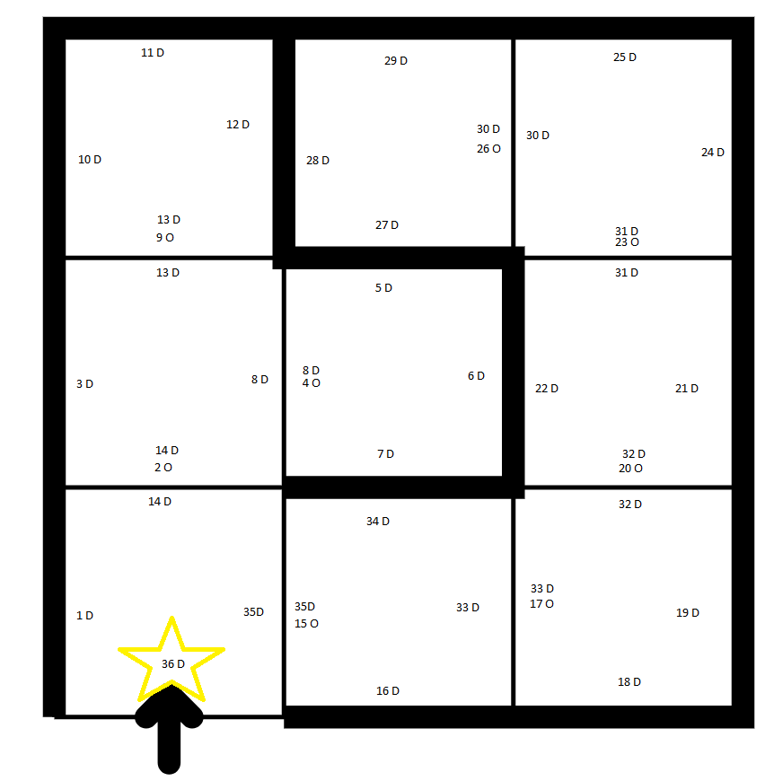

# Introduktion til ingeniørarbejde - Efterår 2020
- Course: 02121
- Date: 8/10/2020
- Group: 13 (Daniel F. Hauge)
- Repo: https://github.com/DanielHauge/02121-robot-explorer

The task and descriptions are vague. Hence we need to specify more precisly.

A further specification for placing marks. As the assignment describes: "The robot can leave arbitrary marks on the square the robot is on". To be more exact, the robot can leave marks corresponding to the 4 directions for the robot to move. The robot can place marks in each direction perspectively: Behind, Front, left and right side of robot.

The robot is able to detect if the robot is hitting into a wall and cannot move in that direction.

## a) Success Criteria
Completely explored meaning to have been explored all squares, according to what the robot thinks.
(in this case, indicated by the robot moving into a tile and placing the 4th done mark.)

## b) Marks

- Done mark, indicating everything has been explored in that direction.
- Origin mark, indication the robot came from this direction.
- Question mark, indicating that the robot moved here but went back.

## c) Strategy
The strategy is adopting a similar strategy to DFS, Depth-first search. By traversing down unexplored paths first, by going deep very fast. Then going backwards when a path is no deeper, by the origin mark. 
The robot is to follow the algorithm:

- while(direction without done mark exists)
  - if (random direction with no marks exists) => Turn to that direction and try move. place "done mark" in front
    - if (wall) place done mark in front.
    - else if (origin, done and question mark behind) continue
    - else if (origin mark behind) Turn 180 degrees, place question mark in front and move (go back).
    - else place "origin mark" behind
  - if (origin mark exists) => Turn to that direction, place done mark in front and move.
  - if (question mark exists) => Place done and move that direction.

In other words:

Stop when there is 4 done marks in each directions, as 4 done marks in all directions means that there is no more unexplored tiles left. When there is a direction with no marks, prioritize trying to move in this direction. When trying to move in a markless (unexplored) direction, if there is a wall, place a done mark for that direction. For a succesful move, read if all 3 marks are present at the source direction and continue without placing a mark, if read showed a single origin mark at source direction place a done mark and move back, otherwise place origin mark. If there are no longer any markless (unexplored) directions left for the current tile and there is still origin marks left, turn to one of the origin marks place a done mark and move there.
At some point the robot will have explored all paths when finding a tile where it reads 4 done marks.

## d) Functional test
Below is a picture of how the robot moved through the building and placing marks. The number represents the step number / or in which order the mark was placed. O=(Origin), D=(Done), ?=(Question)

## e) Generic solution
It works for any building, as the algorithm ensures that no path is getting closed or marked as done unless all paths in that direction is explored. Ensuring a direction has been fully explored is ensured by prioritizing unmarked directions and placing origin marks instead of done. This means that a path is only marked as done when it is either a wall or moving backwards on an origin mark. Circular floors is handled by the question mark logic, this ensures that floors with circular design can also be handled by the algorithm.

## f) Runtime analysis
In the worst case scenario for a tile, it could get entered 8 times. 1 time for each direction first time, and 1 time for each direction entered a second time. The worst case scenario is very unlikely and required a lot of circularity. However worst case scenario is very unlikely, and even more unlikely to occur more than once.

# References:
- [Task description from Learn](https://learn.inside.dtu.dk/d2l/lms/dropbox/user/folder_submit_files.d2l?ou=44473&db=15162&grpid=53419)
